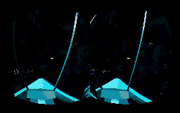

UE4 Space Shooter VR Template
=============================
This is a template focused on a space shooter cockpit style game specifically designed for VR

Current version **0.1**

Features
--------
* Full 6DOF pawn
* IK based hand interaction with the steering wheel
* Two weapons, one straight fire laser rockets the other target seeking missile
* 3D menu for scalability settings
* 3D HUD with time based interactions for triggering missiles

Installation
------------
1. Download the Template
1. Unzip the package into your templates directory, generally in 'C:\Program Files\Unreal Engine[Version]\Templates'
1. Open UE4 and create a new project you should see a new option 'Blueprint VR Space Shooter' choose that

Videos
------
[Introduction](http://youtu.be/9Ks2LIDFMbY)